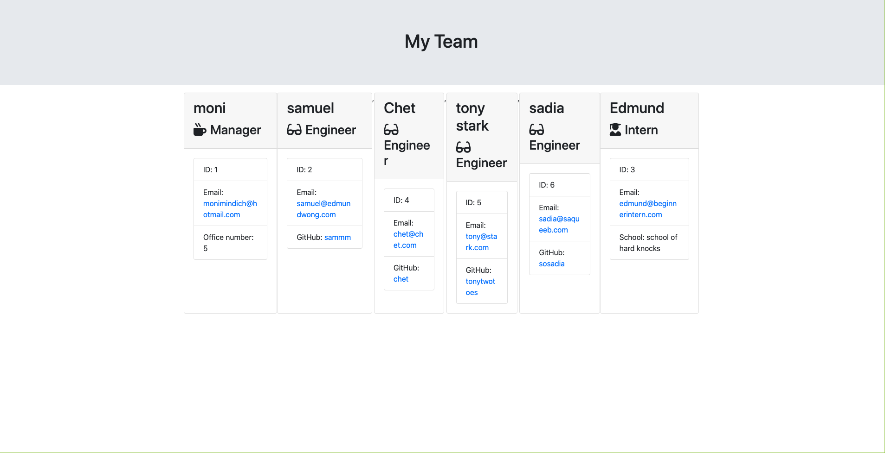

# Employee-Management

## Abstract
> This application will ask prompts to user on node, and then it will create an HTML file that displays nicely formatted team roster based on the information provided by the user.

## Table of contents
* [Abstract](#Abstract)
* [Installation](#Installation)
* [Usage](#Usage)
* [Sample](#Sample)
* [Technologies](#Technologies)
* [Contact](#Contact)
* [Licence](#Licence)

## Installation

To install user require to use terminal and node to run this program.
 

```sh
npm install

```


## Usage
 
first type a below command on terminal
```sh
node app.js

```
and follow the instructions.


### result view



## Technologies

* Visual Studio (for demonstration)
* Recording tool: [screencastify](https://www.screencastify.com/)
* Node.js: [Node.js](https://nodejs.org/)


#### Contact
Email: monimindich@hotmail.com


#### Licence
MIT license
copyright (c) Moni Mindich